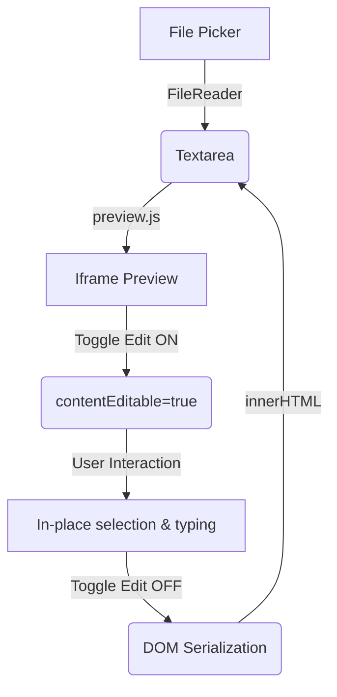

# Plan: M5 — Load & Edit

**Status**: Draft
**Spec Reference**: [spec.md](file:///Users/mpedroso/0.MyPetProjects/MJRPhtmlPreview/docs/specs/m5/spec.md)

## Architecture Approach
We will extend the existing modular architecture:
- `js/app.js`: Event listeners for new buttons.
- `js/preview.js`: Edit mode logic and iframe initialization.
- `js/export.js`: (No changes expected).
- `js/drive.js`: (No changes expected).

## Technical Design

### Feature 1: File Picker (Load Content)
1.  **UI**: Add a button `#btnOpen` to the toolbar in `index.html`.
2.  **Input**: Create a hidden `<input type="file">` tagged with `accept=".html,.htm,.md"`.
3.  **Loading**: 
    - `#btnOpen` clicks the hidden input.
    - `change` event on input uses `FileReader.readAsText()`.
    - Resulting string updates `editor.value`.
    - Trigger `app.updatePreview()` (existing logic).

### Feature 2: Inline Visual Editing
1.  **UI**: Add a toggle button `#btnEdit` in the toolbar.
2.  **State Management**:
    - `isEditMode` boolean in `app.js` or `preview.js`.
3.  **Entering Edit Mode**:
    - `iframe.contentDocument.body.contentEditable = true`.
    - Add a CSS class `.editing-active` to the `#preview-container` to show a green border and an "EDITING" badge.
4.  **Exiting Edit Mode (Sync)**:
    - Set `contentEditable = false`.
    - Capture `iframe.contentDocument.body.innerHTML`.
    - Update `textarea.value` with the new HTML.
    - **Markdown Caveat**: If the source was Markdown, this action replaces the Markdown code with the rendered HTML. A confirmation dialog will be shown before entering Edit Mode for Markdown content.

## UI/UX Mockups (ASCII)

### Toolbar with New Buttons
```
+-----------------------------------------------------------------------+
| MJRPhtmlPreview  📂 [Open]  ✏️ [Edit]       [Clear]  [Drive]  [PDF] ... |
+-----------------------------------------------------------------------+
```

### Preview Area in Edit Mode
```
+-----------------------------------------------------------------------+
| EDITING MODE ACTIVE (Green Badge)                                     |
| +-------------------------------------------------------------------+ |
| | [Text selected and being typed over...]                           | |
| |                                                                   | |
| | (Green border around iframe)                                      | |
| +-------------------------------------------------------------------+ |
+-----------------------------------------------------------------------+
```

## Data Flow


## Documents Consulted
- `arch.md`: Verified modular JS structure.
- `design-system.md`: Checked color tokens for the "Editing" indicator (using `#3fb950` Success Green).
- `constitution.md`: Ensured vanilla-first approach (using `FileReader` and `contentEditable`).

## Risks & Considerations
- **HTML Cleanup**: Serializing `innerHTML` might introduce browser-specific artifacts (e.g., extra spans or whitespace). We will accept standard DOM serialization for M5.
- **Lost Markdown**: Users might be surprised that their Markdown disappears. The warning is critical.
- **Base Href**: Editing content visually should still respect images loaded via `base href`.
